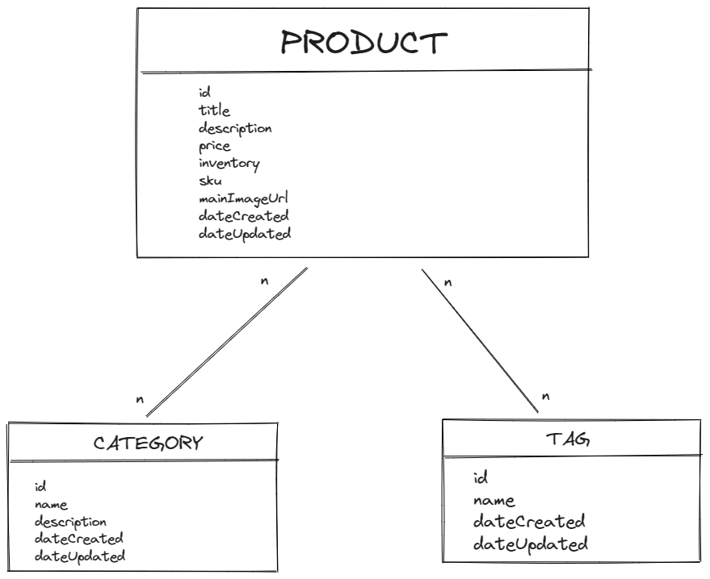

## BACKEND TASK
Create a backend API for users to manage products for an online store (think a Shopify/e-commerce catalog). 

Using the API, users should be able to: 
- Retrieve a collection of products
- Users can optionally retrieve a collection of products sorted by title or date created 
- Add a new product to their inventory (product title, SKU, images etc.)
- Group products together by category or tags 

## Data Models

> **All models are defined in src/model.js**

## Getting Set Up

The exercise requires [Node.js](https://nodejs.org/en/) to be installed. I recommend using the LTS version.

1. Start by creating a local repository for this folder.

1. In the repo root directory, run `npm install` to gather all dependencies.

1. Next, `npm run seed` will seed the local SQLite database. **Warning: This will drop the database if it exists**. The database lives in a local file `database.sqlite3`.

1. Then run `npm start` which should start the server.

1. You can use Postman with the provided collection file (artifacts/smtp.postman_collection). You just need to import this collection into Postman.

## Next improvements

1. Unit testing

1. Improve error returns

1. New endpoints for creating categories and tags
